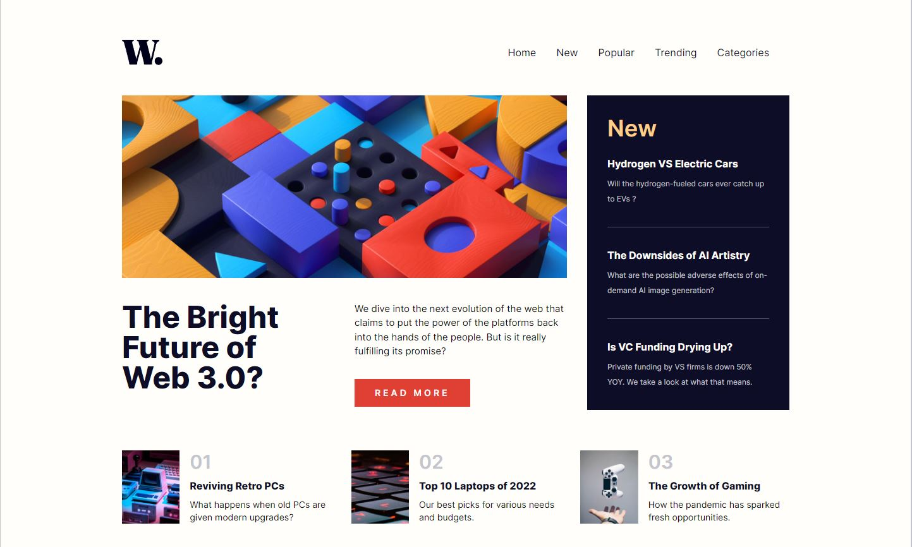

# Frontend Mentor - News homepage solution

This is a solution to the [News homepage challenge on Frontend Mentor](https://www.frontendmentor.io/challenges/news-homepage-H6SWTa1MFl). Frontend Mentor challenges help you improve your coding skills by building realistic projects. 

## Overview

### The challenge

Users should be able to:

- View the optimal layout for the interface depending on their device's screen size
- See hover and focus states for all interactive elements on the page

### Screenshot

### Link

- Solution URL: [Github Pages](https://avishaypesk.github.io/news-homepage-main/)

### Built with

- Semantic HTML5 markup with [JSX](https://reactjs.org/docs/introducing-jsx.html)
- [React](https://reactjs.org/)
- [Tailwind CSS](https://tailwindcss.com/)
  - CSS Grid
  - Flexbox
- Responsive design for all resolutions

## Author

- Website - [Avishay Peskin](https://www.avishaypesk-news.ignorelist.com/)
- Frontend Mentor - [@avishaypesk](https://www.frontendmentor.io/profile/avishaypesk)
- Linkdin - [@avishaypesk](https://www.linkedin.com/in/avishay-peskin-127779219/)
